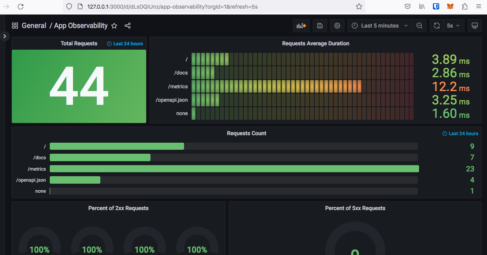
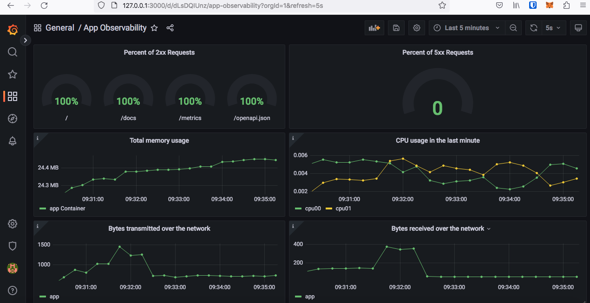

<h2>Python HTTP API - FastAPI + Grafana + Prometheus + Cadvisor </h2>

## > Instalação

Pré-requisitos:

* [Docker](https://docs.docker.com/get-docker/)
* [Docker-compose](https://docs.docker.com/compose/install/)

Clonar localmente o repo da aplicação:

``` bash
git clone https://github.com/mrrobotleo/fastapi-grafana-prometheus-cadvisor.git
```

## > Como usar

Após a instalação do docker e docker compose basta rodar o comando abaixo:

``` bash
docker-compose up
```
## > Aplicação - FastAPI

* APP: http://localhost

## > Stack de monitoração

* Prometheus: http://localhost:9090/
* Grafana: http://localhost:3000/
* Cadvisor: http://localhost:8080/

## > Grafana Dashboard

<p align="center">
  
</p>
<p align="center">
  
</p>

## > Referências
* [FastAPI](https://fastapi.tiangolo.com/)
* [Get started with Grafana and Prometheus](https://grafana.com/docs/grafana/latest/getting-started/get-started-grafana-prometheus/)
* [Prometheus FastAPI Instrumentator](https://pypi.org/project/prometheus-fastapi-instrumentator/1.1.1/)
* [Monitoring Docker container metrics using cAdvisor](https://prometheus.io/docs/guides/cadvisor/)
